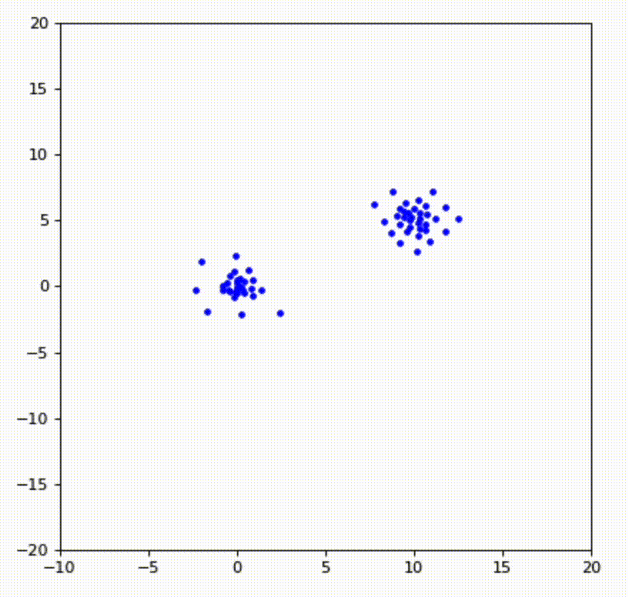

# Topo-GEN: Topology-Informed Generative Models

This repository presents a new approach for training generative models leveraging computational topology. In particular, we use persistence diagrams, a mathematical tool providing a description of the "shape" of point clouds in any metric space. With shape we refer to features such as clusters, loops, or higher-dimensional holes, among other properties. This union seeks to provide models with previously unexplored information about the structure of the true and the generated data, in order to enhance their training process. 

In particular, we introduce a new family of topological regularizers that can be implemented into the training process of any generative model. More in general, they can be implemented as loss functions in any machine learning problem that involves learning to generate a point cloud from another input point cloud, regardless of their dimensions, number of points, or format. In fact, a key aspect of persistence diagrams is that they translate the topological and geometrical features of point clouds into an object that can be efficiently compared among different point clouds, even if they lie in different spaces and have different numbers of points.

Algorithms in this repository are fully supported to run on the GPU. 

# Installation

To install the repository:
```
pip install https://github.com/JackBJ23/Topo-GEN.git
``` 

# Proof-of-concept example: synthetic experiments

To visualize the information captured by the topological regularizers, we provide three proof-of-concept examples. In each case, we start with a random point cloud in 2D, and we set their coordinates as learnable parameters, updated through gradient descent. In particular, we impose a ground truth persistence diagram that captures some topological properties. In each training step, we compute the persistence diagram of the learnable point cloud, and measure its dissimilarity with the ground truth diagram using the bottleneck loss. Using backpropagation and gradient descent to minimize this loss, we update the coordinates of the point cloud. In each case, we see that the topological loss teaches the point cloud to continuously deform and rearrange itself to reach the desired topological properties. 

In the first test (left), we start with 5 clusters, and the ground truth persistence diagram indicates the presence of 3 clusters. The point cloud thus deforms itself to reach this goal. 

In the second test (middle), we start with 2 clusters, and the ground truth persistence diagram indicates the presence of 4 clusters. 

In the third test (right), we start with 2 segments, and the ground truth persistence diagram indicates the presence of one circle. 

<div style="display: flex; justify-content: space-between;">
    
    
    
</div>

To run these synthetic experiments:
```
--python synthetic_experiments.py
```
To run new synthetic experiments with new point clouds:
```
--python synthetic_experiments.py --point cloud (add) --true_point_cloud (add)
```
The algorithm will directly convert the true point cloud into the ground truth diagram capturing its properties (to avoid the need of manually designing the diagram). Leaving --loss_parameters blank will lead to using the bottleneck loss of degrees 0 and 1. Otherwise, fill the vector of weights [w_bottleneck0, w_bottleneck1, w_entropy0, w_entropy1, w_ksigma0, w_ksigma1, w_density] with some non-negative float values. Each is asociated with a different topological loss. 

# Working principle of topology-informed generative models

The working principle of topology-informed variational autoencoders (or other generative models) is illustrated below, and can be summarized as follows. Take a generative model that produces images or any type of data that can be represented as an array of real numbers, and view each data element as an individual point. During each training iteration, a batch of N data points is given to the model and N points are generated as output. Then, some measure of dissimilarity between the true and the generated data (e.g., binary cross-entropy loss) is computed and used as a loss function. When implementing the topological regularizers, in each training iteration we compute the persistence diagram of the batch of N true points, and the persistence diagram of the N generated points, both viewed as point clouds. The two resulting persistence diagrams are then compared using some measure of dissimilarity, and the regularizer captures this measure. Hence, the modification of the weights of the generative model through gradient descent aims to produce data with a spatial distribution that looks like the distribution of the true data. Furthermore, there is also an extension of this method illustrated below, which relies on applying the topological regularizers on the batch of latent vectors instead of the final outputs of the model, in order to control the distribution in the latent space.


# Basic usage

# Example: TopoVAE

In our experiments, we find interesting behaviors. For instance, a VAE trained wit the bottleneck loss for homology degrees 0 and 1 yields improved image quality and diversity in early training, as shown below (taken at training step 50). Left: input data, middle: output from standard VAE, right: output from TopoVAE. 


This performance correlates with a faster decay of the Binary Cross-Entropy loss during the first 100 training steps, as shown below. 


Furthermore, as shown below, we observe an interesting behavior: when applying topological regularizers, the latent vectors seem to redistribute them selves in a more organized way according to their classes---compared to the standard VAE.


We believe that the integration of topology into generative models through differentiable loss functions represents a promising new direction, with our initial results suggesting promising potential for future applications.

# References

If you found this library useful in your research, please consider citing. 

```bibtex
@article{benarroch2024topogen,
  title={Topogen: topology-informed generative models},
  author={Benarroch Jedlicki, Jack},
  year={2024}
}
